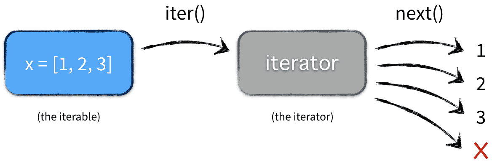

# Polygons and Polygon Iterator

This project defines two main classes, `Polygon` and `Polygons`, to represent individual polygons and a sequence of polygons, respectively. It provides functionality to compute properties of polygons such as area, perimeter, side length, and more. Additionally, the `Polygons` class is made iterable, allowing easy iteration through a sequence of polygons.

## Features

</iimg>

### Polygon Class

The `Polygon` class represents a regular polygon (a polygon where all sides and angles are equal) with the following properties:

- **Vertices and Edges**: Number of vertices and edges (`count_vertices`, `count_edges`).
- **Circumradius**: Radius of the circumcircle (`circumradius`).
- **Interior Angle**: Angle between adjacent sides (`interior_angle`).
- **Side Length**: Length of each side (`side_length`).
- **Apothem**: Distance from the center to the midpoint of a side (`apothem`).
- **Area**: Area of the polygon (`area`).
- **Perimeter**: Perimeter of the polygon (`perimeter`).

- count_vertices: Returns the number of vertices (same as edges).
- count_edges: Returns the number of edges (same as vertices).
- circumradius: Returns the circumradius of the polygon.
- interior_angle: Returns the interior angle of the polygon.
- side_length: Returns the length of each side.
- apothem: Returns the apothem of the polygon.
- area: Returns the area of the polygon.
- perimeter: Returns the perimeter of the polygon.

### Polygons Class

The `Polygons` class is a sequence of `Polygon` objects:

- **Iterable**: The `Polygons` class is iterable, allowing iteration over all polygons in the sequence.
- **Max Efficiency Polygon**: Provides the polygon with the highest area-to-perimeter ratio.
- **Supports Indexing**: Access individual polygons using an index.
- **Length**: Number of polygons in the sequence.

- `__len__`: Returns the number of polygons in the sequence.
- `__getitem__`: Returns the polygon at the given index.
- max_efficiency_polygon: Returns the polygon with the maximum area-to-perimeter ratio.
- `__iter__`: Returns an iterator for the polygons sequence.

## more read
- [iterators](https://nvie.com/posts/iterators-vs-generators/)

